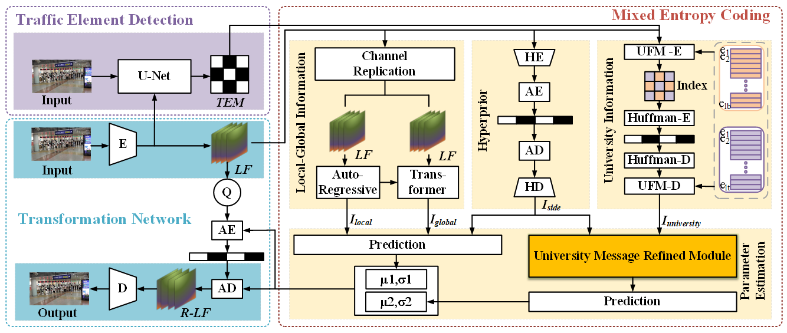
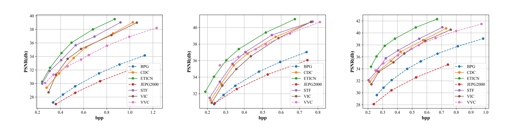
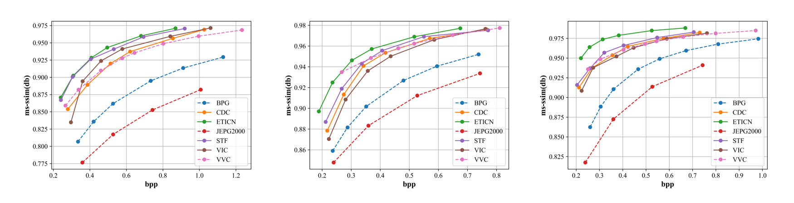
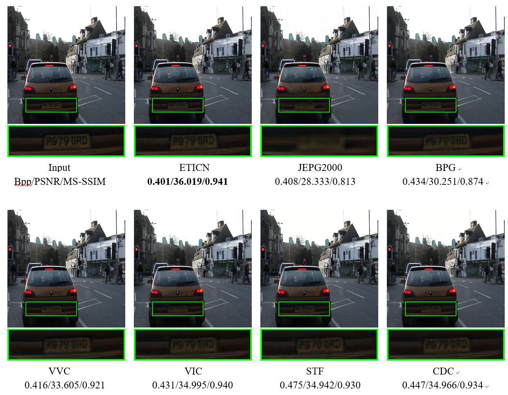
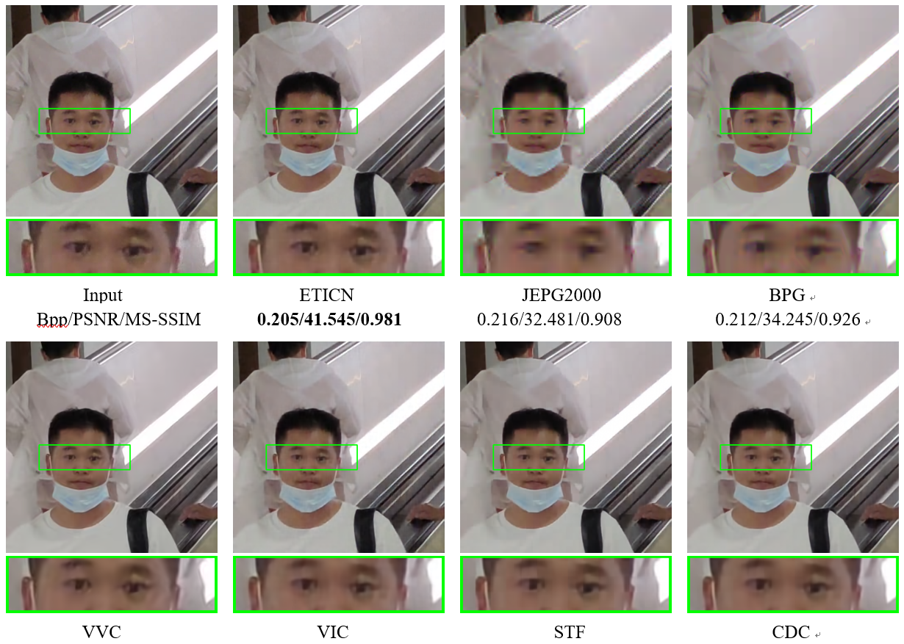

# ETICN: An Efficient Traffic Image Compression Network
Pytorch implementation of the paper "ETICN: An Efficient Traffic Image Compression Network". 
This repository is based on [CompressAI](https://github.com/InterDigitalInc/CompressAI). We kept some scripts, and removed other components. The major changes are provided in `compressai/models`. For the official code release, see the [CompressAI](https://github.com/InterDigitalInc/CompressAI).

## About
This paper defines the eticn model for learned image compression in "An Efficient Traffic Image Compression Network".

>  The architecture of eticn model.

## Installation
Install CompressAI and the packages required for development.
```bash
conda create -n ETICN python=3.10
conda activate ETICN
pip install pybind11
pip install compressai
git clone https://github.com/Hzzz123rfefd/eticn.git
cd eticn
pip install -e .
pip install -r requirement.txt
sh -x script/init_submodules.sh
```

## Usage
### Dataset
Firstly, you can download the Camvid dataset, [Camvid](https://www.kaggle.com/datasets/carlolepelaars/camvid),put them into `datasets/camvid`
your directory structure should be:
- eticn/
  - datasets/
    - camvid/
      - test/
      - test_labels/
      - train/
      - train_labels/
      - val/
      - val_labels/
      - class_dict.csv

Then, you can get the trainning data type using the following scripy:
```bash
python datasets/camvid/process.py --output_dir camvid_train
```

### Trainning
An examplary training script with a rate-distortion loss is provided in `train.py`.
You can adjust the model parameters in `config/eticn.yml`
```bash
python train.py --model_config_path config/eticn.yml
```

### Evaluation
you can evaluate a trained model on your own dataset, the evaluation script is:
```bash
python example/eval.py --model_config_path config/eticn.yml --data_path camvid_train/train.jsonl --model_path saved_model/ --lamda 0.0002
```

## Result
### RD curves




>  RD curves on [camvid](https://www.kaggle.com/datasets/carlolepelaars/camvid)、[SODA10M](https://soda-2d.github.io/download.html)、[TRANS](TODO)

### Visualization

>  Visualization of the reconstructed image of example one.


>  Visualization of the reconstructed image of example two.

### Pretrained Models
Pretrained models (optimized for MSE) trained from scratch using  images from the Camvid dataset.

| Method | Lambda | Link                                                                                              |
| ---- |--------|---------------------------------------------------------------------------------------------------|
| ETICN | 0.0002 | [eticn_0002](https://pan.baidu.com/s/1zYa8pGu7SWgnBAFw6zMy2w?pwd=tr2x) |
| ETICN | 0.0004 | [eticn_0004](https://pan.baidu.com/s/12Ai_NHQGw-AfJdEMzZNOcA?pwd=gd8u)    |
| ETICN | 0.0009 | [eticn_0009](https://pan.baidu.com/s/1dRoiXIlBsrlTBBojCW1_RA?pwd=n1ek) |
| ETICN | 0.0016  | [eticn_0016](https://pan.baidu.com/s/1ctyCfyMiUYOMIYYlMFDW2g?pwd=hzwi)  |
| ETICN | 0.0036  | [eticn_0036](https://pan.baidu.com/s/1ABlyniwVMIlekTfiUZLmiA?pwd=53fx)     |
| ETICN | 0.0081 | [eticn_0081](https://pan.baidu.com/s/1RGYPJ_teGVrn0qGOEOKFpg?pwd=igay) |


## Related links
 * CompressAI: https://github.com/InterDigitalInc/CompressAI
 * Swin-Transformer: https://github.com/microsoft/Swin-Transformer
 * STF:https://github.com/Googolxx/STF
 * camvid Images Dataset: https://www.kaggle.com/datasets/carlolepelaars/camvid
 * SODA10M Images Dataset: https://soda-2d.github.io/download.html

# CQVRTICN: Channel-base Quantization-error-aware Variable Rate Traffic Image Compression Network
