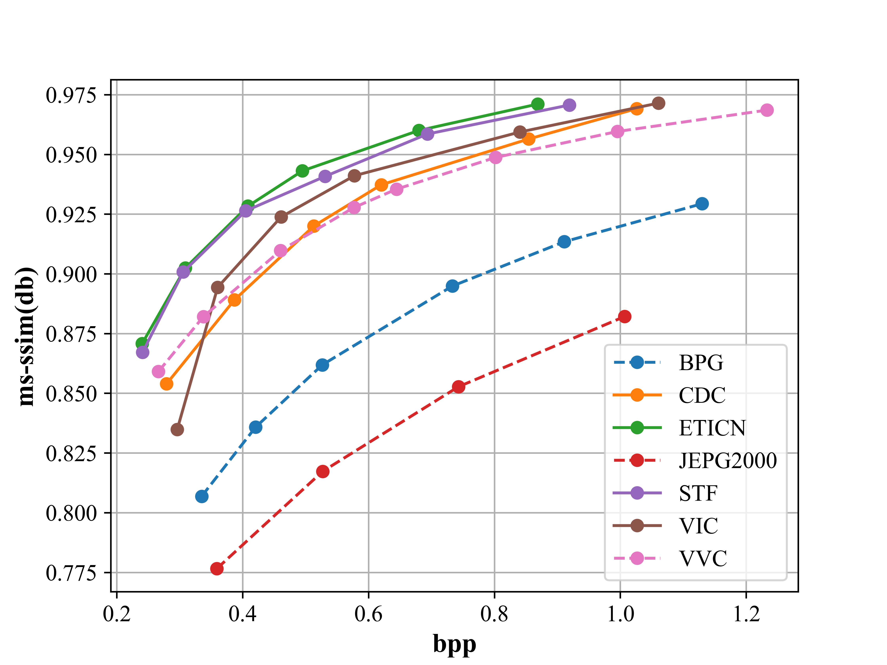

# ETICN: An Efficient Traffic Image Compression Network

## About
TODO

## Installation
Install CompressAI and the packages required for development.
```bash
conda create -n ETICN python=3.10
conda activate ETICN
pip install pybind11
pip install compressai
git clone https://gitee.com/Hz092811/cgvq-vae-compress.git
cd stf
pip install -e .
pip install -r requirement.txt
```

## Usage
### Dataset
TODO

### Trainning
An examplary training script with a rate-distortion loss is provided in train.py.
You can adjust the model parameters in cof/eticn.yml
```bash
python train.py --model_config_path cof/eticn.yml
```

### Evaluation
you can evaluate a trained model on your own dataset, the evaluation script is:
TODO

## Result
### RD curves




TODO：